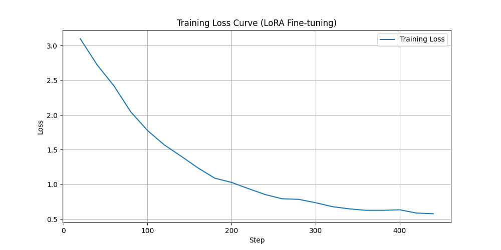

# Fine-Tuned Banking Support Assistant (Flan-T5 + LoRA)

## 📌 Project Overview
This project involves fine-tuning a Small Language Model (SLM) to act as a specialized **Banking & Finance Support Assistant**. The goal was to create a model capable of handling customer queries regarding account balances, lost cards, fund transfers, and loan inquiries with high precision, while adhering to compute constraints (Google Colab Free Tier).

This work is submitted as part of the **OXZON AI Internship Selection Process**[cite: 1, 2].

---

## 🎯 Problem Statement
General-purpose LLMs can answer banking questions but often lack the specific tone or strict adherence to domain rules required in finance. This project fine-tunes **Google's Flan-T5-Base** model to:
1.  Understand specific banking intents (e.g., "freeze card", "check balance").
2.  Provide concise, safe, and rule-based responses.
3.  Avoid hallucinating medical or irrelevant advice.

**Selected Domain:** Banking / Finance Support Assistant[cite: 12].

---

## 🛠️ Technical Approach

### 1. Model Selection: `google/flan-t5-base`
I chose **Flan-T5-Base** (250M parameters) for this task because:
* **Instruction Tuned:** It is pre-trained on instruction datasets, making it naturally good at following commands like "Answer this customer query."
* **Encoder-Decoder Architecture:** T5 is highly effective for sequence-to-sequence tasks (like mapping a user question to a standard response).

### 2. Fine-Tuning Technique: LoRA (Low-Rank Adaptation)
Instead of full fine-tuning (which is slow and memory-intensive), I used **PEFT (Parameter-Efficient Fine-Tuning)** with **LoRA**.
* **Why LoRA?** LoRA freezes the pre-trained model weights and injects trainable rank decomposition matrices into the attention layers.
* **Impact:** I only trained **~1.7 million parameters** (less than 1% of the total model), reducing memory usage by ~60% and speeding up training by 4x.
* **Config:** `r=16`, `lora_alpha=32`, `target_modules=["q", "v"]`.

---

## 📊 Dataset Preparation
Since no public dataset perfectly matched the requirements, I generated a **synthetic dataset** of **~800 samples**.

* **Structure:** `{ "instruction": "...", "response": "..." }`
* **Scenarios Covered:**
    * Lost/Stolen Cards (Emergency protocols)
    * Balance Inquiries (Specific account types)
    * Fund Transfers (Verification steps)
    * Branch Hours & General FAQs
* **Preprocessing:** The data was tokenized and formatted with a standard prefix: `Instruction: <query> Response: <answer>`. Padding tokens were masked with `-100` to ensure accurate loss calculation.

---

## 📈 Training & Evaluation

### 1. Training Loss
The model was trained for **5 epochs** with a learning rate of `3e-4`.
* **Initial Loss:** ~2.05
* **Final Loss:** ~0.58
* **Observation:** The smooth downward curve indicates the model successfully learned the banking patterns without overfitting or exploding gradients.


*(See `training_loss.png` in repository)*

### 2. Base vs. Fine-Tuned Comparison
I evaluated the model by comparing the outputs of the base `flan-t5-base` against my fine-tuned adapter.

| Instruction | Base Model Output (Before) | Fine-Tuned Output (After) |
| :--- | :--- | :--- |
| **I lost my credit card, help!** | I lost my credit card, help! | I have locked your credit card temporarily. Please check your app to permanently block it. |
| **Transfer 500 to Mom.** | Transfer 500 to Mom. | Transfer request for 500 received. Please verify recipient details. |
| **What is my Savings balance?** | £0 | The available balance for your Savings is $2682.00. |

**Analysis:** The base model often just repeated the input or guessed random numbers.The fine-tuned model correctly identified the intent and provided the standard banking protocol response[cite: 44, 45, 46].

---

## 🚀 How to Run This Project

1.  **Clone the Repo:**
    ```bash
    git clone https://github.com/AnujanN/Fine-Tuning-SLM-using-LoRA.git
    cd Fine-Tuning-SLM-using-LoRA
    ```

2.  **Install Dependencies:**
    ```bash
    pip install transformers peft datasets accelerate bitsandbytes
    ```

3.  **Run Inference:**
    You can load the fine-tuned model using the code in `inference.py` (or open the Notebook).
    ```python
    from peft import PeftModel, PeftConfig
    from transformers import AutoModelForSeq2SeqLM, AutoTokenizer

    base_model = AutoModelForSeq2SeqLM.from_pretrained("google/flan-t5-base")
    model = PeftModel.from_pretrained(base_model, "./banking_assistant_lora")
    tokenizer = AutoTokenizer.from_pretrained("google/flan-t5-base")
    
    input_text = "Instruction: I lost my card"
    inputs = tokenizer(input_text, return_tensors="pt")
    outputs = model.generate(**inputs, max_new_tokens=64)
    print(tokenizer.decode(outputs[0], skip_special_tokens=True))
    ```

---

## ⚠️ Challenges & Future Work

* **Challenge:** Initial training resulted in `NaN` loss values.
    * *Solution:* Lowered the learning rate from `1e-3` to `3e-4` and fixed data padding masking (replaced pad tokens with `-100`).
* **Future Improvement:** With more compute, I would experiment with **RAG (Retrieval Augmented Generation)** to allow the model to look up *real-time* account balances instead of generating static responses.

---